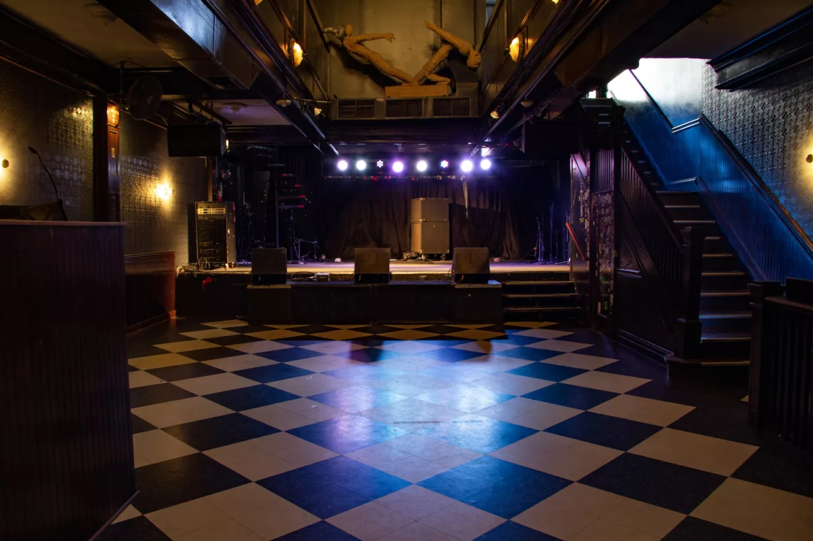

+++
address = '2011 W North Ave'
city = 'Chicago'
state = 'IL'
zip = '60647'
title = 'Subterranean'
+++

Photo courtesy of [Subterranean Live](https://subt.net/virtual-tour-and-gallery/).

Since 1994, Subterranean has been a cornerstone of Chicago's Wicker Park live music and nightlife scene. The venue occupies a historic building constructed in the 1890s, which previously housed a brothel, a bathhouse, and a wire room for gambling during Prohibition. Its preserved original details include the Tiffany and brass chandelier above the dance floor.

The upstairs music room hosts touring and local acts, while Downstairs at Subterranean offers a smaller lounge space. The venue has hosted artists including Dinosaur Jr., Lizzo, Tame Impala, Halsey, Pussy Riot, Built to Spill, Brand New, and Fall Out Boy.

Details from [Subterranean's venue history](https://subt.net/venue-bio/).
